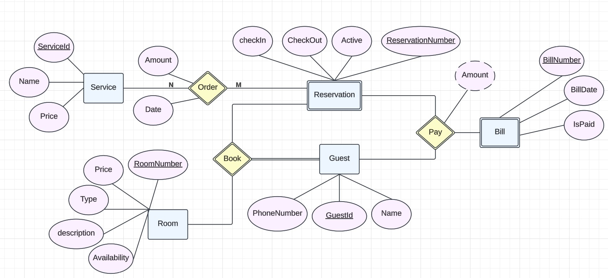
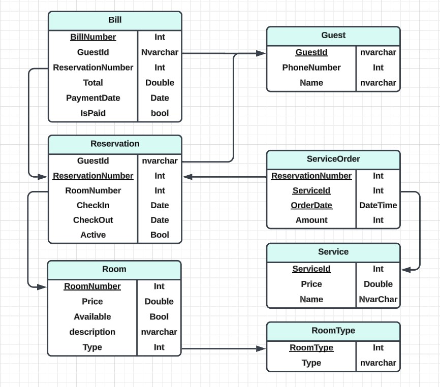

# Hotel Management System
<p align="center">
  
</p>

## Overview
The **Hotel Management System** is a web-based application built using the ASP.NET MVC framework. It streamlines essential hotel operations, including room reservations, guest management, service orders, and billing. This project aims to provide a user-friendly interface and efficient backend processes to improve hotel operations and enhance guest satisfaction.

---

## Features

### 1. **Room Management**
- Add new rooms with details like type, price, and availability.
- View and delete rooms as needed.

### 2. **Guest Management**
- Maintain guest records with essential details for better service.

### 3. **Reservations**
- Book rooms by searching for availability based on check-in and check-out dates.
- Manage active and past reservations with ease.

### 4. **Service Orders**
- Allow guests to request additional services.
- Track and bill service orders efficiently.

### 5. **Billing and Payments**
- Automate bill generation for completed stays and services.
- Process payments and update payment statuses.

---

## Technology Stack

### **Frontend**
- **HTML5, CSS3, Bootstrap**: For responsive and intuitive design.
- **JavaScript, jQuery, AJAX**: For dynamic and interactive elements.

### **Backend**
- **ASP.NET MVC**: Framework for application logic and routing.
- **Entity Framework**: For database interaction.
- **Repository Design Pattern**: Ensures a clean and maintainable data access layer.
- **SOLID Principles**: Provides a scalable and robust architecture.

### **Database**
- **SQL Server**: Relational database to manage data efficiently.

---

## Setup Instructions

1. **Clone the Repository**:
   ```bash
   git clone https://github.com/mahmoud-abouelazm/ElsayedElbadawyHotel/tree/main
   ```

2. **Open the Solution**:
   - Open the project in **Visual Studio**.

3. **Configure the Database**:
   - Update the connection string in the `appsettings.json` file to match your SQL Server configuration.

4. **Run Migrations**:
   ```bash
   Update-Database
   ```

5. **Start the Application**:
   - Run the project using IIS Express or your preferred method in Visual Studio.

6. **Access the Application**:
   - Navigate to `http://localhost:[port]` in your browser.

---

## Entity-Relationship Diagram

*The ER diagram illustrates the relationships between various entities in the system.*

<p align="center">
  
</p>

## Database Schema
Below is the schema used for the system's database:

### Tables
- **Guest**: Stores guest information.
- **RoomType**: Defines different types of rooms.
- **Room**: Manages room details and availability.
- **Reservation**: Handles room bookings.
- **Service**: Stores additional services offered.
- **ServiceOrder**: Tracks service orders linked to reservations.
- **Bill**: Automates billing and payment statuses.
<p align="center">
  
</p>


